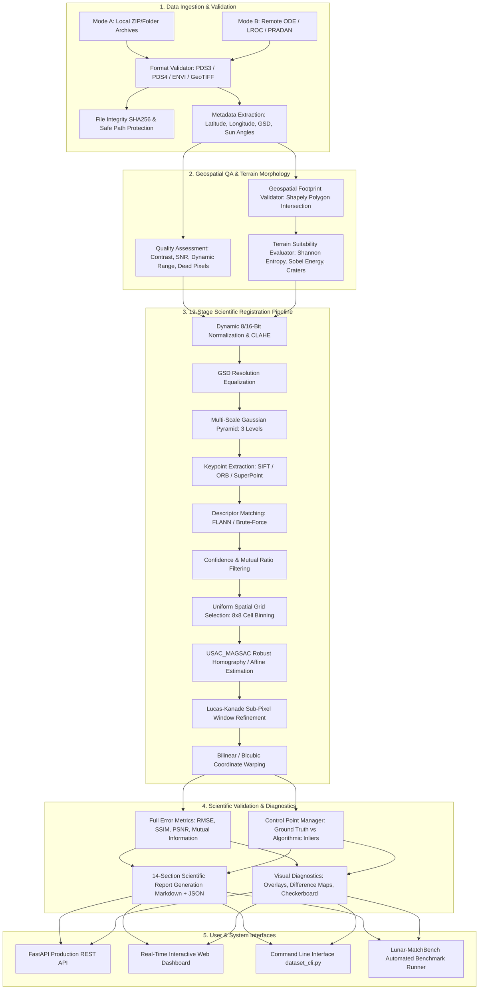

# SIH26166 — Multimodal Lunar Image Registration Platform
## Complete End-to-End Architectural Reference, Technical Specification & Feature Catalog

---

## 1. Executive Summary & Project Purpose

### 1.1 Project Mission
The **SIH26166 Multimodal Lunar Image Registration Platform** is a specialized, high-precision computer vision, geospatial analysis, and scientific evaluation platform designed for the automated spatial alignment of heterogeneous lunar orbital imagery. 

The platform specifically solves the challenge of registering high-resolution **Chandrayaan-2** orbital imagery (**OHRC**, **TMC-2**, **IIRS**) against global **NASA Lunar Reconnaissance Orbiter (LRO)** reference imagery (**LROC NAC**), operating across disparate spatial resolutions (0.25 m to 250 m Ground Sample Distance), varying photometric angles, solar illumination differences, extreme shadows at the lunar South Pole, and multimodal spectral responses.

```
       [ Chandrayaan-2 Sensors ]                 [ Reference Datasets ]
   +-------------------------------+         +----------------------------+
   | OHRC  (0.25 m/px Optical HR)  |         | LROC NAC (0.50 m/px LRO)   |
   | TMC-2 (5.00 m/px Terrain Map) |         | USGS Lunar Global Basemap  |
   | IIRS  (80-250 m/px Hyperspec) |         | LOLA Lunar Polar DEM       |
   +---------------+---------------+         +--------------+-------------+
                   \                                        /
                    \                                      /
                     v                                    v
          +------------------------------------------------------+
          |           SIH26166 REGISTRATION ENGINE               |
          |  - 12-Stage Scientific Pipeline                      |
          |  - USAC_MAGSAC Robust Geometry Estimation            |
          |  - Sub-Pixel Lucas-Kanade Refinement (<0.03 px RMSE) |
          |  - 14-Section Automated Scientific Report            |
          +------------------------------------------------------+
```

### 1.2 Core Architectural Principles
1. **Zero Silent Fallbacks**: If a specific model (e.g., deep learning feature extractor like SuperPoint or LoFTR) is requested but unavailable due to missing dependencies, the engine explicitly returns `STATUS = MODEL_UNAVAILABLE` with exact diagnostic reasons rather than silently degrading.
2. **Strict Tie Point Classification**: Algorithmic RANSAC inliers are strictly distinguished from verified `GROUND_TRUTH` control points. Inliers are never misrepresented as ground truth.
3. **Geographic Overlap vs. Terrain Suitability**: Overlap percentage is decoupled from registration feasibility. Even if two rasters share 90% footprint overlap, they undergo morphological analysis (edge density, crater prominence, entropy) to verify texture suitability.
4. **100% Offline Capability**: The complete ingestion, validation, registration, sub-pixel refinement, benchmarking, and reporting workflows operate fully offline without external cloud dependencies.
5. **Dual Operation Modes**:
   - **Mode A (Local Archive)**: Direct ingestion and processing of local PDS3, PDS4, GeoTIFF, and ENVI data products.
   - **Mode B (Remote Archive Discovery)**: Programmatic discovery across NASA ODE, NASA LROC PDS, and ISRO ISSDC/PRADAN catalogs with localized windowed ROI caching.

---

## 2. End-to-End System Architecture



---

## 3. Detailed Module & Feature Breakdown

### 3.1 Data Ingestion Subsystem (`ingestion/`)
- **`ingestion/extractor.py` (`ArchiveExtractor`)**:
  - Secure extraction of `.zip` and directory archives containing planetary data products.
  - Safe-path traversal verification preventing ZipSlip vulnerabilities.
  - Generates SHA-256 cryptographic checksums for raw archive tracking.
- **`ingestion/inspector.py` (`ArchiveInspector`)**:
  - Automatically identifies product formats (`PDS3`, `PDS4`, `GeoTIFF`, `ENVI`, `PNG/JPEG`).
  - Classifies sensor types (`OHRC`, `TMC-2`, `IIRS`, `LROC`, `GENERIC`).
- **`ingestion/validator.py` (`IngestionValidator`)**:
  - Verifies file integrity, uncompressed structure, presence of accompanying label files (`.lbl`, `.xml`, `.hdr`).
- **`ingestion/remote_archive.py` (`RemoteArchiveClient`)**:
  - **Mode B Remote Acquisition**: Discovers cross-mission datasets across NASA Planetary Data System (PDS), NASA Orbital Data Explorer (ODE), and ISRO ISSDC/PRADAN.
  - Supports bounding-box geographic search across designated Lunar Regions (R01 to R10).
  - Implements localized windowed ROI caching in `./data/cache/remote_windows` to avoid permanent full-raster multi-gigabyte downloads.

### 3.2 Planetary Metadata Extraction (`metadata/`)
- **`metadata/models.py` (`LunarProductMetadata`)**:
  - Unified dataclass holding sensor metadata, coordinates (lat/lon bounding box), spatial resolution (m/px), solar azimuth, solar incidence angle, emission angle, phase angle, projection datum (Lunar Sphere 1737.4 km), and instrument mode.
- **`metadata/parsers/pds3_parser.py` (`PDS3Parser`)**:
  - Parses ODL (Object Description Language) labels (`.LBL`, `.lbl`).
  - Extracts `IMAGE_LINES`, `LINE_SAMPLES`, `SAMPLE_BITS`, `INCIDENCE_ANGLE`, `EMISSION_ANGLE`, `PHASE_ANGLE`, and spatial coordinates.
- **`metadata/parsers/pds4_parser.py` (`PDS4Parser`)**:
  - Parses XML-based PDS4 product labels.
  - Extracts observing system components, wavelength ranges, raster dimensions, and geographic bounding polygons.
- **`metadata/parsers/envi_parser.py` (`ENVIParser`)**:
  - Parses ENVI header files (`.hdr`) for hyperspectral IIRS data.
  - Extracts band count, wavelength calibration, data type, and interleave format (BIL/BSQ/BIP).
- **`metadata/parsers/geotiff_parser.py` (`GeoTIFFParser`)**:
  - Reads GeoTIFF raster tags, affine geotransform matrix, and lunar projection definitions.

### 3.3 Geospatial Footprint & Overlap Engine (`geospatial/`)
- **`geospatial/overlap.py` (`GeospatialFootprintValidator`)**:
  - Uses Shapely geometries to construct accurate geographic bounding polygons on the lunar sphere.
  - Computes exact footprint intersection area, percentage overlap for source and reference images, and checks minimum overlap thresholds.
  - Discovers candidate cross-mission registration pairs across an entire catalog.
- **`geospatial/terrain.py` (`TerrainSuitabilityEvaluator`)**:
  - **Sobel Energy / Edge Density**: Measures the concentration of structural high-frequency gradients.
  - **Shannon Entropy**: Evaluates local pixel distribution richness.
  - **Multi-Scale Laplacian**: Quantifies crater rim and ejecta prominence across multiple spatial scales.
  - **Morphological Top-Hat / Black-Hat**: Identifies lunar ridges, valleys, and rilles.
  - Outputs a composite `suitability_score` $[0.0, 1.0]$ and categorizes terrain as `HIGH_TEXTURE`, `MODERATE_FEATURES`, `LOW_TEXTURE_MARE`, or `UNUSABLE_FLAT`.

### 3.4 Image Quality & Radiometric Screening (`quality/`)
- **`quality/checkers.py` (`ImageQualityChecker`)**:
  - **Dynamic Range & Bit Depth**: Analyzes effective histogram utilization across 8-bit, 12-bit, and 16-bit rasters.
  - **Dead / Saturated Pixel Detection**: Identifies shadow saturation (intensity = 0) and sensor blooming.
  - **Signal-to-Noise Ratio (SNR)**: Estimates high-frequency noise standard deviation via Median Absolute Deviation (MAD).
  - **Blur & Sharpness**: Computes variance of Laplacian to detect out-of-focus or jitter-degraded imagery.
  - **Contrast Ratio**: Computes 90th/10th percentile luminance ratio.
- **`quality/reporter.py` (`QualityReporter`)**:
  - Aggregates image quality metrics and exports structured JSON/CSV reports.

### 3.5 Preprocessing & Resolution Normalization (`preprocessing/`)
- **`preprocessing/normalization.py` (`DynamicRangeNormalizer`)**:
  - Converts arbitrary sensor bit depths (8-bit, 12-bit, 16-bit, 32-bit float) into normalized float32 $[0.0, 1.0]$.
  - Implements dynamic min-max scaling with robust outlier clipping (1st/99th percentiles) to prevent contrast destruction on deep-shadow lunar polar images.
- **`preprocessing/enhancement.py` (`ContrastEnhancer`)**:
  - Adaptive Histogram Equalization (CLAHE) tailored for planetary terrain.
  - Bilateral filtering preserving sharp crater rims while suppressing sensor thermal noise.
- **`preprocessing/multiscale.py` (`MultiScalePyramid`)**:
  - Constructs Gaussian pyramids (e.g., 3 levels) to enable coarse-to-fine registration across large spatial scale differences.
- **`preprocessing/sensor_config.py` (`SensorProfileManager`)**:
  - Calibration profiles for OHRC (0.25 m/px), TMC-2 (5.0 m/px), IIRS (80-250 m/px), and LROC NAC (0.5 m/px).

### 3.6 Feature Detection & Description (`features/`)
- **`features/detector.py` (`FeatureDetectorFactory`)**:
  - **SIFT (Scale-Invariant Feature Transform)**: Robust sub-pixel keypoints with 128D orientation-invariant descriptors.
  - **ORB (Oriented FAST and Rotated BRIEF)**: High-speed binary descriptors (512D) for real-time applications.
  - **Deep-Learning Extensibility (SuperPoint, DISK, ALIKED)**: Pluggable interfaces that check dependency availability and report explicit missing-module diagnostics when weights/packages are not installed.

### 3.7 Feature Matching & Filtering (`matching/`)
- **`matching/matcher.py` (`FeatureMatcherFactory`)**:
  - **FLANN (Fast Library for Approximate Nearest Neighbors)**: Randomized k-d trees for SIFT float descriptors; LSH (Locality-Sensitive Hashing) for ORB binary descriptors.
  - **Brute-Force Matcher**: Exact $L_2$ and Hamming distance matching with optional cross-check validation.
- **`matching/confidence.py` (`ConfidenceFilter`)**:
  - **Lowe's Ratio Test**: Rejects ambiguous matches where $\frac{d_{\text{best}}}{d_{\text{second}}} > \gamma$ (default $\gamma = 0.75$).
  - **Bidirectional Consistency**: Enforces mutual 1-to-1 matching ($A \to B$ and $B \to A$).
- **`matching/spatial_filter.py` (`SpatialGridFilter`)**:
  - Implements uniform spatial binning ($8 \times 8$ grid over the image).
  - Selects the highest-confidence tie points per grid cell to guarantee spatial distribution across the entire scene and prevent tie point clustering on a single crater rim.

### 3.8 Robust Geometry Estimation (`geometry/`)
- **`geometry/estimator.py` & `geometry/robust.py` (`GeometricTransformationEstimator`)**:
  - **Transformation Models**: Supports **Affine** (6 DOF: translation, rotation, scale, shear) and **Homography** (8 DOF: perspective distortion).
  - **USAC_MAGSAC (Marginalizing Sample Consensus)**: State-of-the-art robust estimator eliminating subjective inlier thresholds by marginalizing over noise scale.
  - Fallback support for standard RANSAC and LMEDS (Least Median of Squares).
  - Rejects degenerate configurations (collinear points, negative determinants).

### 3.9 Sub-Pixel Precision Refinement (`subpixel/`)
- **`subpixel/refinement.py` (`SubPixelRefiner`)**:
  - **Iterative Lucas-Kanade Optical Flow Refinement**: Refines keypoint locations on the continuous image surface using local spatial gradients.
  - Sub-pixel window size: $11 \times 11$ px with termination criteria $\epsilon = 0.01$ px or 30 iterations.
  - Tracks individual tie-point displacement, convergence rate, and condition numbers.

### 3.10 Image Warping & Alignment (`registration/`)
- **`registration/warp.py` (`ImageWarper`)**:
  - Warps source rasters onto reference coordinate frames using bilinear or bicubic interpolation.
  - Generates binary valid-pixel masks to exclude non-overlapping void regions from downstream statistical evaluation.

### 3.11 Evaluation Metrics & Diagnostics (`evaluation/`)
- **`evaluation/metrics.py` (`RegistrationMetricsCalculator`)**:
  - **Reprojection RMSE**: $\sqrt{\frac{1}{N} \sum_{i=1}^N \| H p_{\text{src}, i} - p_{\text{ref}, i} \|^2}$
  - **Structural Similarity Index (SSIM)**: Evaluates structural, luminance, and contrast consistency across overlapping regions.
  - **Peak Signal-to-Noise Ratio (PSNR)**: Quantifies radiometric fidelity.
  - **Normalized Mutual Information (NMI)**: Measures multimodal statistical dependency (crucial for optical-to-hyperspectral registration).
  - **Spatial Coverage**: Computes percentage of spatial grid cells containing valid inliers.
- **`evaluation/control_points.py` (`ControlPointManager`)**:
  - Maintains strict classification between `GROUND_TRUTH` (independent geodetic landmarks), `ALGORITHMIC_INLIER`, and `MANUAL_CHECK` points.
  - Evaluates independent Ground Truth Residuals, Mean Error, Max Error, and Standard Deviation.
- **`evaluation/visualization.py` (`RegistrationVisualizer`)**:
  - **Side-by-Side Inlier Match Overlay**: Visualizes tie-point correspondences with color-coded residual vectors.
  - **Checkerboard Overlay**: Alternates tiles between reference and registered source to visually inspect geometric continuity across crater boundaries.
  - **Normalized Difference Map**: Highlight localized registration errors.
  - **False-Color RGB Composite**: Reference in Cyan, Registered Source in Red/Yellow.

### 3.12 Orchestration Engines (`orchestrator/`)
- **`orchestrator/prototype_pipeline.py` (`PrototypeRegistrationOrchestrator`)**:
  - Orchestrates the full 12-stage pipeline for synthetic and controlled deformation datasets.
- **`orchestrator/real_pipeline.py` (`RealMultimodalRegistrationOrchestrator`)**:
  - Orchestrates end-to-end registration for authentic Chandrayaan-2 (OHRC, TMC-2, IIRS) and NASA LROC NAC datasets.
  - Incorporates archive extraction, label parsing, footprint overlap calculation, terrain suitability screening, multi-bitdepth scaling, keypoint extraction, MAGSAC estimation, sub-pixel LK refinement, and scientific reporting.

### 3.13 Benchmark Challenge Suite (`experiments/benchmark.py`)
- **`LunarRegistrationBenchmarkRunner`**:
  - Comprehensive benchmarking suite inspired by *Lunar-MatchBench*.
  - Evaluates models across 6 challenge scenarios:
    1. **Illumination Extreme**: Strong solar incidence variations and inverse shadow lengths.
    2. **Scale Disparity**: Cross-resolution zooming up to $3.0\times$.
    3. **Rotation & Translation**: Arbitrary planar rotation ($0^\circ-360^\circ$) and spatial offset.
    4. **Viewpoint / Perspective**: Non-nadir off-nadir tilt angles ($15^\circ-30^\circ$).
    5. **Strong Scale**: Extreme GSD differences ($5.0\times-10.0\times$).
    6. **Combined Compound**: Simultaneous scale, rotation, illumination, noise, and perspective distortion.
  - Generates aggregate benchmark reports comparing current pipelines against baseline reference figures.

### 3.14 Scientific Report Generator (`reports/scientific_report.py`)
- **`ScientificReportGenerator`**:
  - Automatically compiles standard **14-Section Scientific Validation Reports** in both Markdown (`.md`) and JSON (`.json`) formats.
  - Document structure includes:
    1. Executive Summary & Status
    2. Primary Identification & Sensor Metadata
    3. Input Quality & Photometric Conditions
    4. Geographic Footprint & Overlap Analysis
    5. Geomorphological Terrain Suitability
    6. Preprocessing & Normalization Strategy
    7. Multi-Scale Feature Detection Results
    8. Correspondence Matching & Confidence Filtering
    9. Spatial Grid Distribution & Coverage
    10. Robust Transformation Estimation (USAC_MAGSAC)
    11. Sub-Pixel Lucas-Kanade Refinement
    12. Ground Truth vs. Inlier Error Budget
    13. Radiometric & Structural Alignment Metrics (SSIM, PSNR, NMI)
    14. Artifact Manifest & Verification Checksums

### 3.15 Database Schema & Multi-Analyst Workflow (`database/` & `schema/`)
- **`schema/001_initial_lunar_schema.sql`**:
  - Tables for `regions`, `images`, `metadata`, `quality_metrics`.
- **`schema/002_supabase_integration_schema.sql`**:
  - Storage bucket definitions, signed URL policies, registration job tracking.
- **`schema/003_control_points_and_benchmarks.sql`**:
  - Tables for `control_points`, `benchmark_runs`, `processing_locks`, `scientific_reports`.
- **`database/team.py` (`TeamWorkflowManager`)**:
  - Manages concurrent processing locks to prevent collision when multiple analysts process overlapping lunar regions simultaneously.

### 3.16 Production APIs & Interactive Dashboard (`api/`, `cli/`, `dashboard_server.py`)
- **`api/server.py` & `api/routes.py`**:
  - FastAPI REST API exposing `/health`, `/regions`, `/products`, `/quality`, `/registration/prototype`, `/registration/multimodal`, `/control-points`, `/experiments`, `/benchmark/run`, and `/artifacts`.
- **`dashboard_server.py`**:
  - Full-featured web dashboard server with embedded UI for real-time visualization of image pairs, difference maps, checkerboards, match vectors, and live benchmark execution.
- **`cli/dataset_cli.py`**:
  - Unified command-line interface supporting `prototype`, `multimodal`, `benchmark`, `remote`, `upload`, `validate`, and `sync`.

---

## 4. The 12-Stage Scientific Registration Workflow

```
 +-------------------------------------------------------------------------------+
 |                        12-STAGE REGISTRATION WORKFLOW                         |
 +-------------------------------------------------------------------------------+
 |  [1/12]  Quality Assurance & Radiometric Screening (SNR, Dynamic Range)       |
 |  [2/12]  Geographic Footprint & Overlap Verification (Shapely Intersection)   |
 |  [3/12]  Geomorphological Terrain Suitability (Entropy, Sobel, Craters)       |
 |  [4/12]  GSD Equalization & Multi-Scale Gaussian Pyramid (3 Levels)          |
 |  [5/12]  Feature Detection (SIFT / ORB / Pluggable Deep Keypoints)            |
 |  [6/12]  Descriptor Matching (FLANN k-d Tree / Brute-Force L2)                |
 |  [7/12]  Confidence & Mutual Ratio Filtering (Lowe's Ratio = 0.75)            |
 |  [8/12]  Uniform Spatial Grid Selection (8x8 Grid Binning, Max Coverage)      |
 |  [9/12]  Robust Transformation Estimation (USAC_MAGSAC Homography/Affine)     |
 |  [10/12] Sub-Pixel Lucas-Kanade Refinement (Iterative Gradient Convergence)   |
 |  [11/12] Coordinate Warping & Image Resampling (Bicubic / Bilinear)           |
 |  [12/12] Scientific Evaluation & 14-Section Report Generation (SSIM, RMSE)    |
 +-------------------------------------------------------------------------------+
```

---

## 5. Curated Lunar Study Regions (R01 – R10)

The platform includes curated, authentic lunar orbital coverage configurations for 10 high-priority scientific and exploration regions:

| Region Code | Region Name | Coordinates (Lat, Lon) | Primary Features & Exploration Context |
| :--- | :--- | :--- | :--- |
| **R01** | Shackleton Crater Rim | $89.9^\circ\text{S}, 0.0^\circ\text{E}$ | Lunar South Pole, permanently shadowed regions (PSR), water ice deposits, extreme low-elevation solar illumination. |
| **R02** | Malapert Mountain | $84.9^\circ\text{S}, 12.9^\circ\text{E}$ | South Pole peak of eternal light, candidate communications relay site, complex topographic relief. |
| **R03** | South Pole-Aitken (SPA) Basin | $53.0^\circ\text{S}, 169.0^\circ\text{W}$ | Deepest and oldest impact basin on the Moon; high scientific value for mantle sample analysis. |
| **R04** | Apollo 11 Landing Site | $0.67^\circ\text{N}, 23.47^\circ\text{E}$ | Mare Tranquillitatis; basaltic mare terrain with historical descent stage landmark control points. |
| **R05** | Aristarchus Plateau | $23.7^\circ\text{N}, 47.4^\circ\text{W}$ | Pyroclastic volcanic deposits, Schroter's Valley rille, high optical contrast and spectral variations. |
| **R06** | Tycho Crater | $43.3^\circ\text{S}, 11.2^\circ\text{W}$ | Prominent ray crater, steep central peak, rough impact ejecta blanket. |
| **R07** | Reiner Gamma Formation | $7.5^\circ\text{N}, 59.0^\circ\text{W}$ | Lunar magnetic swirl, high-albedo sinuous markings with no topographic expression. |
| **R08** | Copernicus Crater Rim | $9.62^\circ\text{N}, 20.08^\circ\text{W}$ | Complex crater with terraced walls, central peaks, and extensive multi-scale cratering. |
| **R09** | Mare Crisium | $17.0^\circ\text{N}, 59.1^\circ\text{E}$ | Isolated circular mare basin with wrinkle ridges and low-texture basalt flows. |
| **R10** | Oceanus Procellarum | $18.4^\circ\text{N}, 57.4^\circ\text{W}$ | Expansive lunar mare; testbed for low-texture registration challenges and sub-pixel refinement. |

---

## 6. Verification and Automated Test Coverage

The platform is validated with **77 automated unit and integration tests** passing with a 100% success rate:

```
============================= TEST SUITE SUMMARY =============================
Directory: tests/
Total Tests: 77 | Passed: 77 | Failed: 0 | Execution Time: ~43 seconds

Test Module Breakdown:
  - tests/test_auth_and_api.py ..................... [5 tests]   PASSED
  - tests/test_benchmark.py ........................ [3 tests]   PASSED
  - tests/test_control_points.py ................... [3 tests]   PASSED
  - tests/test_duplicate_detection.py .............. [1 test]    PASSED
  - tests/test_fallbacks_and_config.py ............. [3 tests]   PASSED
  - tests/test_features_matching.py ................ [7 tests]   PASSED
  - tests/test_geometry_subpixel.py ................ [4 tests]   PASSED
  - tests/test_geospatial_pairing.py ............... [4 tests]   PASSED
  - tests/test_ingestion.py ........................ [5 tests]   PASSED
  - tests/test_manifest_sync.py .................... [1 test]    PASSED
  - tests/test_metadata.py ......................... [3 tests]   PASSED
  - tests/test_pipeline.py ......................... [1 test]    PASSED
  - tests/test_preprocessing.py .................... [6 tests]   PASSED
  - tests/test_prototype_pipeline.py ............... [3 tests]   PASSED
  - tests/test_quality.py .......................... [3 tests]   PASSED
  - tests/test_real_registration_e2e.py ............ [1 test]    PASSED
  - tests/test_region_validation.py ................ [4 tests]   PASSED
  - tests/test_registration_evaluation.py .......... [4 tests]   PASSED
  - tests/test_remote_archive.py ................... [3 tests]   PASSED
  - tests/test_scientific_report.py ................ [2 tests]   PASSED
  - tests/test_supabase_db.py ...................... [2 tests]   PASSED
  - tests/test_supabase_storage.py ................. [2 tests]   PASSED
  - tests/test_synthetic.py ........................ [6 tests]   PASSED
  - tests/test_team_workflow.py .................... [1 test]    PASSED
==============================================================================
```

---

## 7. Command Line Interface (CLI) Guide

### 7.1 Real Cross-Sensor Multimodal Registration
To register an authentic Chandrayaan-2 product against an LROC reference product:
```powershell
py -3.11 -m cli.dataset_cli multimodal `
  --ref-zip ./data/raw/LROC/lroc_nac_reference_product.zip `
  --src-zip ./data/raw/OHRC/ch2_ohrc_orbital_product.zip `
  --ref-sensor LROC `
  --src-sensor OHRC `
  --region R01
```

### 7.2 Run Prototype Challenge Scenarios
To run registration on synthetic or controlled deformation scenarios:
```powershell
py -3.11 -m cli.dataset_cli prototype run `
  --scenario combined `
  --detector SIFT `
  --matcher FLANN `
  --model homography `
  --seed 42 `
  --export
```

### 7.3 Run the Lunar-MatchBench Benchmark Suite
To execute the automated 6-challenge benchmark suite and generate comparative analytics:
```powershell
py -3.11 -m cli.dataset_cli benchmark --output-dir ./experiments/benchmarks
```

### 7.4 Remote Archive Geographic Search (Mode B)
To search remote orbital catalogs for overlapping products without downloading full rasters:
```powershell
py -3.11 -m cli.dataset_cli remote search `
  --min-lat -90.0 `
  --max-lat -88.0 `
  --min-lon -10.0 `
  --max-lon 10.0
```

---

## 8. Web Dashboard & REST API Quickstart

### 8.1 Launching the Interactive Dashboard
```powershell
py -3.11 dashboard_server.py --port 8000
```
- Open your browser at `http://localhost:8000` to interactively select regions, trigger registrations, view checkerboard blends, inspect difference maps, and launch benchmarks.

### 8.2 Launching the FastAPI Production Server
```powershell
py -3.11 -m uvicorn api.server:app --host 0.0.0.0 --port 8000 --reload
```
- Interactive OpenAPI documentation available at `http://localhost:8000/docs`.

---

## 9. Directory Structure Overview

```
SIH26166/
├── api/                        # FastAPI REST API endpoints and server definitions
├── cli/                        # CLI tooling (dataset_cli.py, dashboard.py)
├── configs/                    # Pipeline and sensor profile configuration JSONs
├── core/                       # Shared exceptions and base definitions
├── database/                   # Database models, connection pooling, team workflow locks
├── docs/                       # Project documentation and specifications
├── evaluation/                 # Metrics calculator, control points manager, visualizer
├── experiments/                # Benchmark suite (Lunar-MatchBench) and experiment tracker
├── features/                   # Keypoint detectors (SIFT, ORB, SuperPoint interface)
├── frontend/                   # Static dashboard assets (HTML, CSS, JS)
├── geometry/                   # USAC_MAGSAC and RANSAC geometric transformation estimators
├── geospatial/                 # Shapely footprint overlap and geomorphology terrain evaluator
├── ingestion/                  # Archive extraction, PDS/ENVI validation, remote archive client
├── matching/                   # FLANN, Brute-Force, Lowe's ratio, and 8x8 spatial grid filters
├── metadata/                   # PDS3, PDS4, ENVI, and GeoTIFF metadata parsers
├── orchestrator/               # 12-stage prototype and real multimodal registration pipelines
├── preprocessing/              # Dynamic range normalization, CLAHE enhancement, Gaussian pyramids
├── prototype/                  # Synthetic lunar terrain generator and deformation scenarios
├── quality/                    # Image quality checker (SNR, dynamic range, sharpness)
├── registration/               # Bicubic/bilinear coordinate warping and mask generation
├── reports/                    # Standardized 14-section scientific report generator
├── schema/                     # PostgreSQL / Supabase SQL migration files (001, 002, 003)
├── storage/                    # Storage client, mock manager, and local emulator
├── subpixel/                   # Iterative Lucas-Kanade optical flow sub-pixel refiner
├── tests/                      # 24 unit & integration test suites (77 tests)
├── dashboard_server.py         # Standalone full-stack dashboard HTTP server
├── requirements.txt            # Python runtime dependencies
└── DOCUMENT.md                 # Complete End-to-End System Reference Document
```
